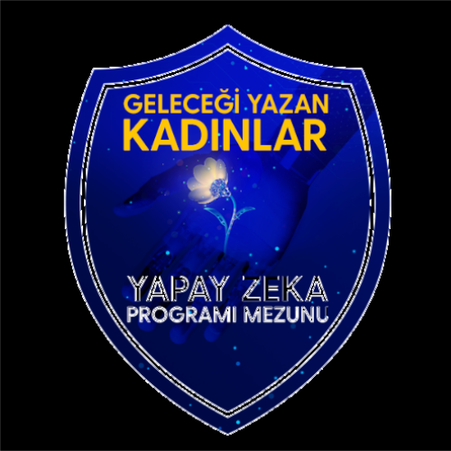

# 🚀 Makine Öğrenimi | TRKCL - GYK Eğitimi

 

Bu repository, Turkcell Geleceği Yazan Kadınlar eğitim programı kapsamında geliştirilen projeleri ve eğitim materyallerini içermektedir.

## 📁 Proje Yapısı

```
├── machinelearning/
│   ├── DECISIONTREE/
│   ├── KNN/
│   ├── NAIVEBAYES/
│   ├── SVM/
│   ├── RANDOMFOREST/
│   ├── KMEANS/
│   └── DBSCAN/
├── hiring-prediction/
├── online-system-api/
├── northwind-customer-behavior-prediction
├── customer_order_prediction
└── lectures/
```

## 🤖 Machine Learning Modelleri

### 🌳 Decision Tree (Karar Ağacı)
Karar ağacı, veri setini sürekli olarak alt gruplara bölerek sınıflandırma veya regresyon yapan bir makine öğrenmesi algoritmasıdır. Her düğümde bir karar kuralı uygulanır ve bu kurallar ağaç yapısı boyunca devam eder. Özellikle yorumlanabilirliği yüksek olan bu model, karmaşık karar süreçlerini basitleştirmek için idealdir.

### 👥 K-Nearest Neighbors (KNN)
KNN, en basit makine öğrenmesi algoritmalarından biridir. Bir veri noktasının sınıfını, en yakın k komşusunun çoğunluk oylamasına göre belirler. Öğrenme aşaması olmayan bu algoritma, tüm veriyi hafızada tutar ve yeni bir veri geldiğinde en yakın komşularını bulur. Özellikle küçük veri setlerinde ve sınıf sayısı az olduğunda etkilidir.

### 📊 Naive Bayes
Naive Bayes, Bayes teoremini kullanarak sınıflandırma yapan bir algoritmadır. Özellikler arasındaki bağımsızlık varsayımına dayanır ve bu nedenle "naive" (saf) olarak adlandırılır. Metin sınıflandırma, spam filtreleme ve duygu analizi gibi uygulamalarda yaygın olarak kullanılır. Hızlı eğitim ve tahmin süreleri ile öne çıkar.

### ⚔️ Support Vector Machine (SVM)
SVM, veri noktalarını en iyi şekilde ayıran bir hiperdüzlem bulmaya çalışan güçlü bir sınıflandırma algoritmasıdır. Marjini maksimize eden bu hiperdüzlem, sınıflar arasındaki sınırı en iyi şekilde belirler. Doğrusal ve doğrusal olmayan sınıflandırma problemlerinde kullanılabilir. Kernel trick sayesinde yüksek boyutlu uzaylarda bile etkili çalışabilir.

### 🌲 Random Forest
Random Forest, birden fazla karar ağacının bir araya gelmesiyle oluşan bir ensemble öğrenme yöntemidir. Her ağaç farklı veri alt kümeleri üzerinde eğitilir ve sonuçlar oylama yöntemiyle birleştirilir. Aşırı öğrenmeye karşı dirençli olan bu model, yüksek doğruluk oranları ve özellik önemini belirleme yeteneği ile öne çıkar.

### 🔄 K-Means
K-Means, veri noktalarını k adet kümelere ayıran popüler bir kümeleme algoritmasıdır. Her kümenin merkezini hesaplar ve veri noktalarını en yakın merkeze atar. Bu işlem, merkezlerin konumu değişmeyene kadar tekrarlanır. Müşteri segmentasyonu, görüntü sıkıştırma ve anomali tespiti gibi uygulamalarda kullanılır.

### 🎯 DBSCAN
DBSCAN (Density-Based Spatial Clustering of Applications with Noise), yoğunluk tabanlı bir kümeleme algoritmasıdır. Veri noktalarının yoğunluğuna dayanarak kümeleme yapar ve gürültü noktalarını tespit edebilir. Küme sayısını önceden belirlemeye gerek olmayan bu algoritma, düzensiz şekilli kümeleri de tespit edebilir. Coğrafi veri analizi ve anomali tespiti gibi uygulamalarda yaygın olarak kullanılır.

## 🎮 Mini Projeler

### 👨‍💼 hiring-prediction
İşe alım süreçlerinde adayların başarı potansiyelini tahmin eden bir makine öğrenmesi projesidir. Geçmiş işe alım verilerini kullanarak, yeni adayların performansını öngörmeye çalışır.

### 🌐 online-system-api
Online sistem için geliştirilmiş RESTful API projesidir. Kullanıcı yönetimi, veri işleme ve sistem entegrasyonu gibi temel işlevleri içerir.

### 📦 northwind-customer-behavior-prediction
Northwind veritabanı üzerinden müşteri davranışlarını analiz eden ve sipariş tahmini, iade riski skoru ile yeni ürün satın alma potansiyelini öngören derin öğrenme tabanlı bir projedir.

### 🍄 customer_order_prediction
Verinin geçmiş satın alma bilgilerini kullanarak müşterilerin gelecekteki siparişlerini tahmin eden bir makine öğrenmesi projesi. `northwind-customer-behavior-prediction` projesinden farklı olarak; koşullar iyileştirilmiştir ve iki farklı filtreleme yapılmıştır. 

## 📚 Eğitim Materyalleri
`lectures/` klasörü, eğitim sürecinde kullanılan tüm ders notlarını ve örnekleri içermektedir.
